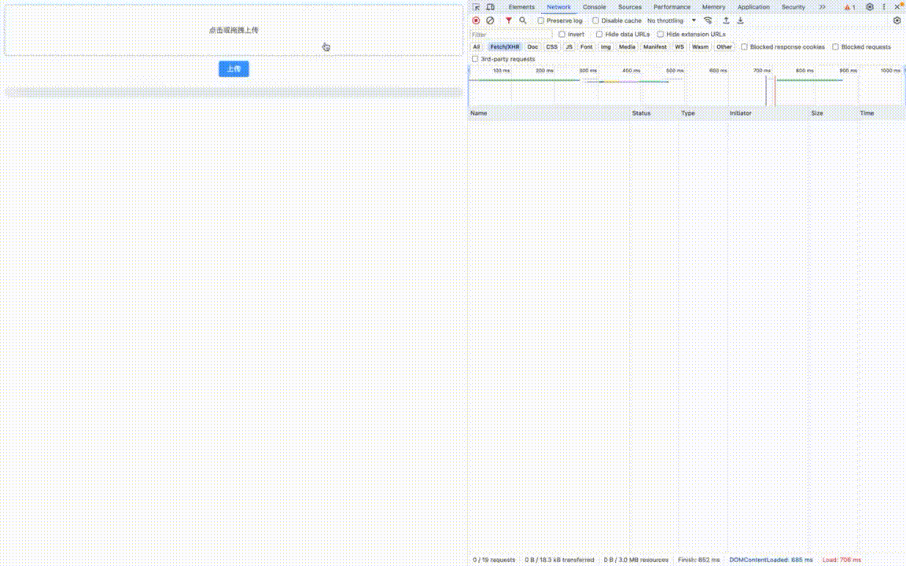

# minio-upload

## 介绍

文件上传到 Minio，实现分片上传、断点续传、秒传等功能。

该项目是一个**极简**的项目，主要理解核心功能的思想：后端项目7个类，仅依赖 minio 和
spring-boot-web；前端项目1个文件，双击运行html文件即可，无需搭建前端环境。

## 技术栈

使用了SpringBoot 2.7、Vue3、element-plus等

## 演示

## 使用

运行 MinioApplication 启动后端项目，双击 index.html 启动前端项目

## 核心点

**分片上传 + 端点续传 + 秒传**

一、前端直接上传到minio

1. 前端上传之前，用md5值查询文件是否存在，存在直接返回文件访问地址，实现秒传
2. 前端向获取上传凭证，后端返回上传凭证
3. 前端对文件切片，上传之前询问后端，'/chunks/文件md5值/分块索引'路径下文件是否存在？
   - 存在，跳过，上传下一个分片
   - 不存在，上传到minio，路径为'/chunks/文件md5值/分块索引'
4. 前端全部发送完毕，发送合并文件请求并带上文件md5值和总分片数，后端根据文件md5值查询分片，并对比数量是否都存在。
   - 存在，合并文件，返回文件访问地址
   - 不存在，返回错误信息，前端重新上传缺少的那块分片

二、前端先上传到服务器，服务器再上传到minio

1. 前端上传之前，用md5值查询文件是否存在，存在直接返回文件访问地址，实现秒传
2. 前端对文件分片，上传到服务器，参数除了文件本身，还需要文件的md5值和分片文件的索引
3. 服务器判断/chunks/文件md5值/分块索引'是否存在，存在直接返回成功，否则上传到minio到'/chunks/文件md5值/分块索引'路径
4. 前端发送完毕请求，参数为文件的md5值和总分片数，后端根据文件md5值查询分片，并对比数量是否都存在。
   - 存在，合并文件，返回文件访问地址
   - 不存在，返回错误信息，前端重新上传缺少的那块分片

端点续传在哪里？

我们可以让分片目录存活一段时间。用户上传3个分片后网络异常，重新连接网络后，已经上传的3个分片已经存在，无需从新上传。

还有一种方式：后端实现分片上传，前端实现秒传。但是这样明显不合适，用户仍然需要等待文件上传到后端，即技术上实现分片，用户体验上没有实现。

我们最后向minio中存储的文件名称都是md5+文件后缀，对于文件管理并不友好，推荐维护一张表，存储上传日期、原始文件名称等信息。

## 维护

本项目提供的是一个上传文件的demo项目，本质是提供思路，故不做方向、需求、功能上的升级。如果有问题，欢迎提issue，如果您有好的实现，欢迎提pr。
